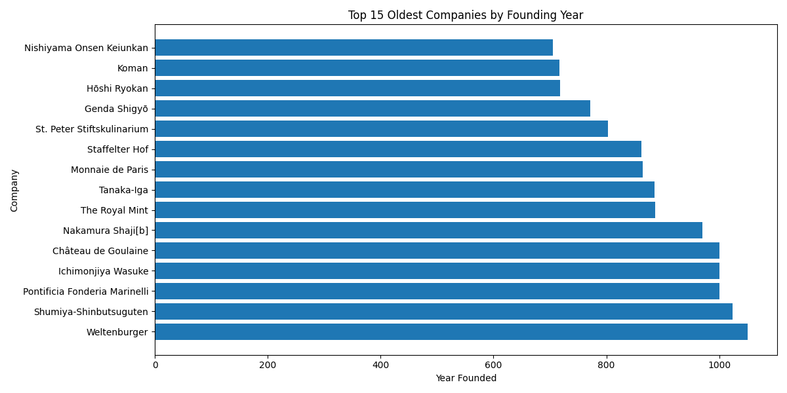
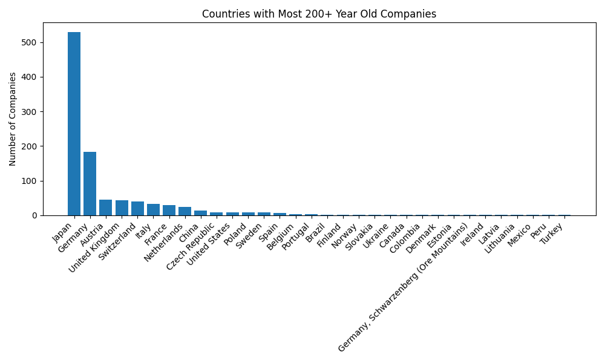
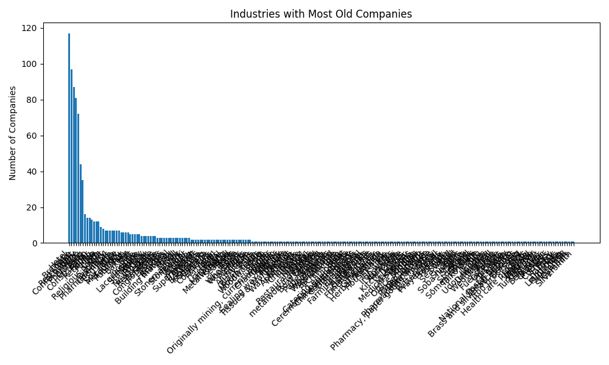
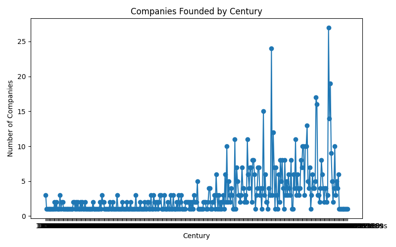

# Analysis of the World's Oldest Businesses

This project analyzes a dataset of the world's oldest continuously operating businesses to uncover patterns related to their industry, country of origin, and founding era.

### 📌 Problem
The core question this analysis seeks to answer is: **“Where are the world’s oldest businesses and what industries/countries do they belong to?”**

### 🛠️ Tools Used
* **Dataset:** Sourced from Kaggle/Wikipedia.
* **Data Cleaning & Analysis:** SQL (using Google BigQuery)
* **Data Visualization:** Python (Matplotlib, Pandas)

---

### 📊 Analysis & Findings

The analysis focused on four key areas, with the following results visualized below:

#### 1. Top 15 Oldest Businesses
This chart identifies the absolute oldest companies in the dataset, showcasing their incredible longevity.

* **✅ Finding:** The world's oldest companies date back over a millennium, with many originating from Japan. The oldest business, Kongō Gumi, was founded in the year 578.

#### 2. Countries with the Most 200+ Year-Old Companies
This analysis highlights which countries are home to the largest number of long-lasting businesses.

* **✅ Finding:** Japan has a significantly higher number of centuries-old businesses compared to other countries, followed by nations like Germany and France. This points to a cultural or economic environment that fosters corporate longevity.

#### 3. Industries That Survive the Longest
This visualization shows which industries have stood the test of time.

* **✅ Finding:** Traditional industries such as Brewing, Hospitality (Inns & Pubs), and Manufacturing dominate the list of the oldest businesses, indicating that essential consumer goods and services are highly resilient.

#### 4. Timeline of Company Creation
This plot tracks the number of founding companies by century, showing historical trends in business creation.

* **✅ Finding:** There was a dramatic increase in the number of businesses founded from the 17th century onwards, aligning with major historical periods like the Industrial Revolution.

---

### 🔗 How to Run This Project

To reproduce this analysis, follow these steps:

**Prerequisites:**
* A Google Cloud Platform account with access to BigQuery.
* The raw CSV file (`oldest_companies.csv`) from the `/data` directory.

**Steps:**

1.  **Set up Google BigQuery:**
    * Create a new project in the Google Cloud Console.
    * Inside your project, create a new BigQuery dataset (e.g., `oldest_businesses`).

2.  **Upload the Data:**
    * In your new dataset, click "Create Table".
    * Set the source as "Upload" and select the `data/oldest_companies.csv` file.
    * Give the table a name (e.g., `companies`).
    * Enable "Auto detect" for the schema and click "Create table".

3.  **Run the SQL Queries:**
    * Open the BigQuery SQL Workspace.
    * Copy the SQL code from the files located in the `/sql` directory (e.g., `01_cleaning.sql`, `02_oldest_companies.sql`, etc.) and run them in order.
    * These queries will clean the data and generate the aggregated tables for analysis.

4.  **Generate Visualizations:**
    * The results from the SQL queries were exported as the CSV files found in the `/exports` folder.
    * The Python script `analysis.py` reads these exported CSVs to generate the plots stored in the `/visuals` directory.
